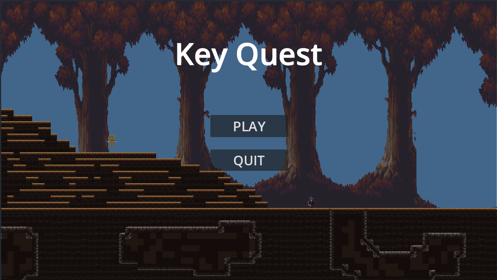
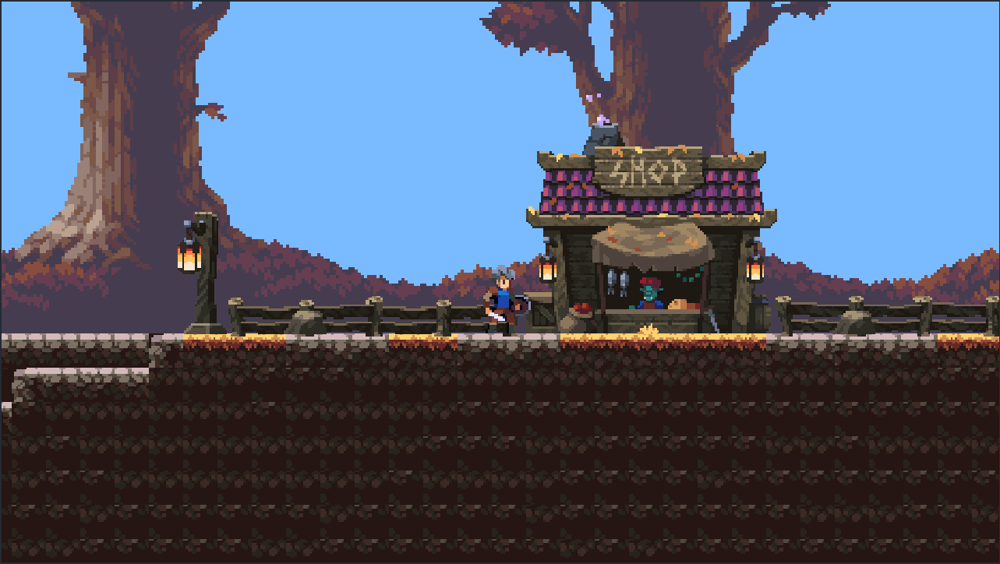
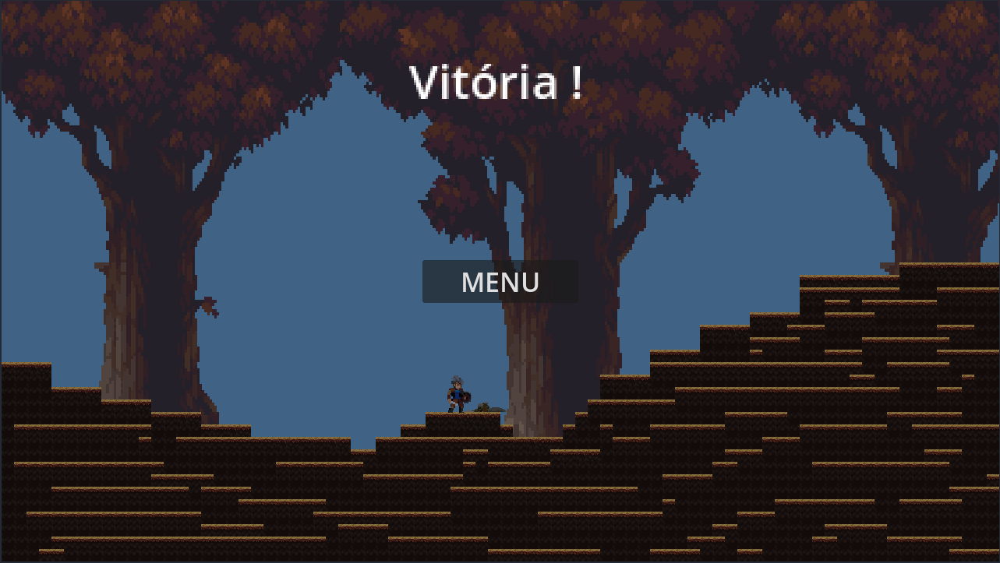

# 🗝️ KeyQuest (Godot)

Projeto desenvolvido na **Godot Engine** como um jogo 2D de aventura/plataforma. O objetivo principal é **explorar o mapa, coletar chaves e alcançar a saída**, evitando inimigos e obstáculos ao longo do caminho.

---

## 🎮 Funcionalidades

### Movimentação do personagem

- Controle fluido em 2D (andar, pular e movimentação lateral).
- Animações sincronizadas com as ações do jogador.

### Sistema de chaves

- Chaves espalhadas pelo mapa.
- Algumas áreas/saídas só são liberadas após coletar as chaves necessárias.

### Inimigos

- Inimigos com movimentação própria.
- Colisão causa derrota ou reinício da fase.
- Diferentes comportamentos (ex: patrulha, perseguição simples).

### Sistema de vitória e derrota

- Vitória ao alcançar a saída após cumprir os requisitos (ex: coletar chaves).
- Tela de vitória dedicada.
- Possibilidade de reiniciar ou voltar ao menu.

### Menu inicial

- Iniciar jogo.
- Organização básica de navegação entre cenas.

---

## 🖼️ Capturas de Tela

| Menu Inicial                                    | Gameplay                                | Menu Final                                  |
| ----------------------------------------------- | --------------------------------------- | ------------------------------------------- |
|  |  |  |

---

## 🛠️ Tecnologias Utilizadas

- **Godot Engine**
- **GDScript** para lógica do jogo
- Sprites 2D e tilesets para cenários e personagens

---

## 📁 Estrutura de Códigos

- `player.gd` – movimentação, animações e colisões do jogador.
- `enemy.gd`, `goomba.gd`, `koopa.gd` – lógica dos inimigos.
- `key.gd` – lógica de coleta de chaves.
- `exit_trigger.gd` – verificação de condições para finalizar a fase.
- `menu.gd` – controle do menu inicial.
- `victory.gd` / `victory_ui.gd` – tela e lógica de vitória.

---

## ▶️ Como Rodar o Projeto

1. Clone ou baixe este repositório:

   ```bash
   git clone https://github.com/pinheiro-code/KeyQuest.git
   ```

2. Abra a pasta do projeto na **Godot Engine**.
3. Execute a cena principal (`menu.tscn` ou a cena configurada como principal).

---

## 📌 Observações

Projeto com foco educacional, utilizado para aprendizado de:

- Lógica de jogos 2D
- Organização de cenas na Godot
- Uso de colisões, sinais e scripts em GDScript

---

✨ _Sinta-se à vontade para evoluir o projeto com novas fases, inimigos e mecânicas!_
